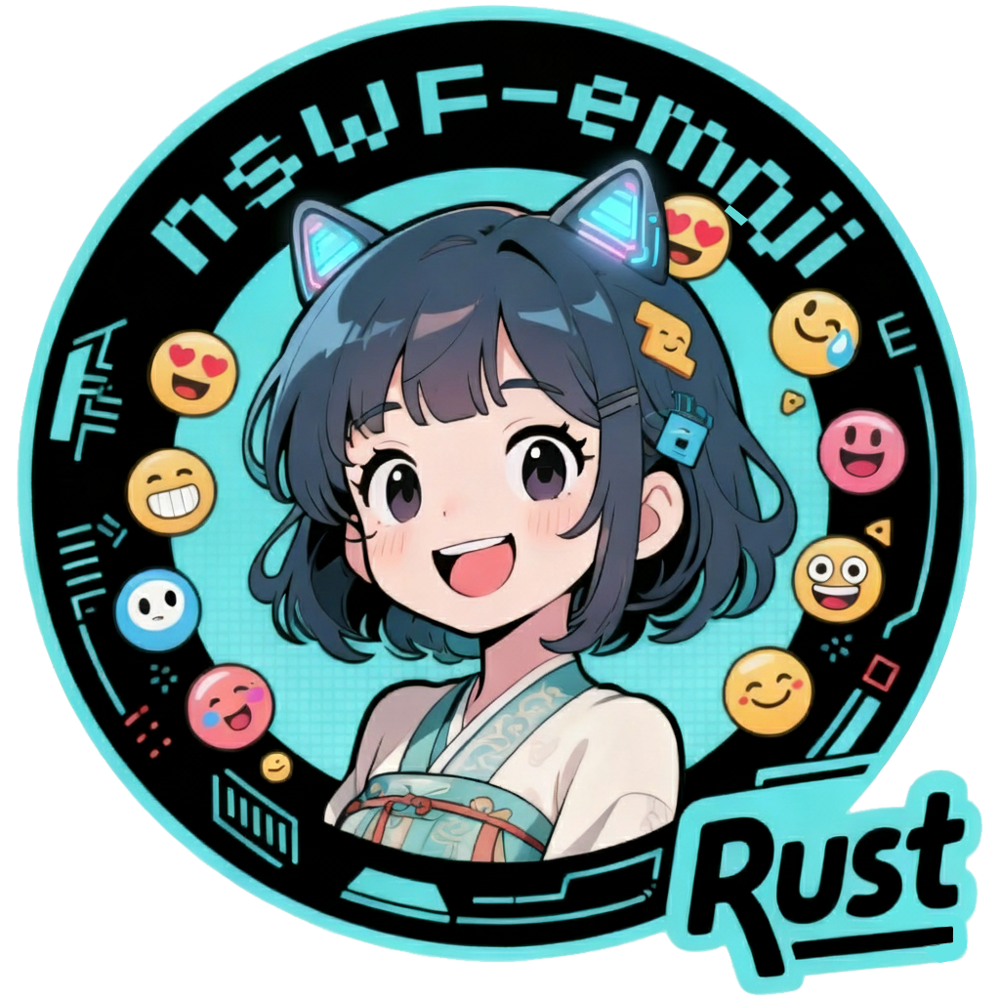
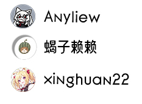

# nsfw-emoji-rs

  
  
  <a href="https://pypi.org/project/meme-generator-rs">
  <a href="https://crates.io/crates/meme_generator">
    
    
  <a href="https://qm.qq.com/q/KZFZGdWmyG">
    

## nsfw-emoji-rs 表情包扩展仓库 

*🚀* 基于 [meme-generator-rs](https://github.com/MemeCrafters/meme-generator-rs) 做的表情包扩展仓库~

*✨* 为你的聊天机器人添加更多趣味表情生成！

> [!WARNING]
>
> *🙅🏻* **NSFW**（全称 **Not Safe/Suitable For Work**）是英文网络流行语，意为**“不适合在工作场合浏览”**，主要用于标记包含敏感或不适内容的网络资源，避免用户在公开场合误点导致尴尬或违规。

## ✨特性

- ✅ **海量表情** 偶尔做做热门表情包，也欢迎投稿高清有趣的素材
- ⚡ **实时生成** 支持通过指令快速生成表情
- 🔄 **搭配使用** 需要搭配 [meme-generator-rs](https://github.com/MemeCrafters/meme-generator-rs) 一起使用

## 🤠 表情示例

### 😀 表情列表清单

#### 😉 名称排序  A-Z

* [表情列表](https://github.com/anyliew/nsfw-emoji-rs/wiki/%E8%A1%A8%E6%83%85%E5%88%97%E8%A1%A8)

## 💐 鸣谢

感谢以下开发者对 nsfw-emoji-rs 仓库作出的贡献

## 📝 反馈

### 🤔 issues

> issues https://github.com/anyliew/nsfw-emoji-rs/issues 

单个表情有问题反馈请附带日志和截图
答复受限网络没那么快及时处理

### 🐧QQ Group

* [进群注意事项](https://github.com/anyliew/meme_emoji/wiki/qq_group)

## 🥳 投稿

> 🚧欢迎投稿高清素材，看到一些有趣的素材图片会制作成表情更新到本仓库！
>
> 通过issues中的模板 “投稿素材” 进行投稿，如果能Pr则更加完美，实在是泰裤辣~

## 🔗 相关链接

### meme-generator-rs 
- [meme-generator-rs](https://github.com/MemeCrafters/meme-generator-rs) 

### wiki 文档
- [meme-generator-rs wiki](https://github.com/MemeCrafters/meme-generator-rs/wiki)

